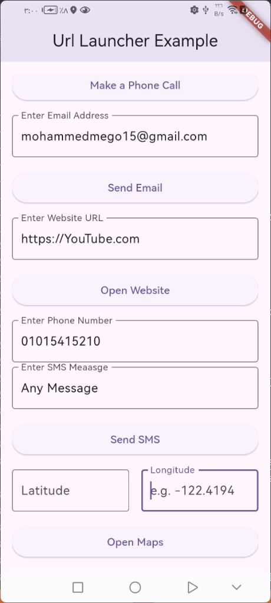

<div align="center">

# *"وَقُلْ رَبِّ زِدْنِي عِلْمًا"*

</div>

## Url Launcher Example Flutter App

This Flutter application demonstrates the use of the `url_launcher` package to launch various types of URLs. The app allows users to initiate phone calls, send emails, send SMS messages, open websites, display maps, and view YouTube videos, all using simple Flutter UI elements. The app is designed with a helper class to simplify the launching of these URLs.

## Features

- **Phone Call**: Initiates phone calls by passing a phone number.
- **Email**: Opens the default email app to send an email to a specific address.
- **SMS**: Sends SMS messages to a phone number with or without a custom message.
- **Website**: Opens websites in the default browser.
- **Maps**: Opens maps (Google Maps for Android and Apple Maps for iOS) using latitude and longitude coordinates.
- **YouTube**: Opens a YouTube video using a video ID.

## Screenshots

### Home Screen (UI)



---

## Installation

To run this project on your local machine, follow these steps:

1. **Clone the repository**:
   ```bash
   git clone https://github.com/your-username/url-launcher-example.git
   cd url-launcher-example
   ```

2. **Install dependencies**:
   Make sure you have [Flutter](https://flutter.dev/docs/get-started/install) installed. Once Flutter is installed, run the following command to fetch the dependencies:
   ```bash
   flutter pub get
   ```

3. **Run the app**:
   After the dependencies are installed, you can run the app using the following command:
   ```bash
   flutter run
   ```

## How to Use

Once you launch the app, you will be presented with the following options:

- **Phone Call**: 
   - Enter a phone number and press "Make a Phone Call."
   - The app will launch the phone dialer with the number pre-filled.

- **Email**:
   - Enter an email address and press "Send Email."
   - The app will launch the default email app with the address pre-filled.

- **SMS**:
   - Enter a phone number and a message, then press "Send SMS."
   - The app will open the SMS app, with the message pre-filled if provided.

- **Website**:
   - Enter a website URL (e.g., `https://www.example.com`) and press "Open Website."
   - The app will open the website in the browser.

- **Maps**:
   - Enter latitude and longitude values (e.g., `37.7749` and `-122.4194` for San Francisco).
   - Press "Open Maps" to view the location in the default maps app (Google Maps for Android, Apple Maps for iOS).

---

## Code Overview

### `url_launcher_helper.dart`

This file contains a helper class, `UrlLauncherHelper`, that provides static methods to launch different types of URLs:

#### 1. **launchPhoneCall()**
   Launches the phone dialer to initiate a phone call.
   ```dart
   static Future<void> launchPhoneCall(context, String phoneNumber)
   ```

#### 2. **launchEmail()**
   Opens the default email client with a given email address.
   ```dart
   static Future<void> launchEmail(context, String emailAddress)
   ```

#### 3. **composeEmail()**
   Opens the default email client with a subject and body to compose an email.
   ```dart
   static Future<void> composeEmail(context, String emailAddress, String subject, String body)
   ```

#### 4. **sendSms()**
   Opens the SMS app with a given phone number and an optional message.
   ```dart
   static Future<void> sendSms(context, String phoneNumber, {String? message})
   ```

#### 5. **launchWebsite()**
   Launches a URL in the browser.
   ```dart
   static Future<void> launchWebsite(context, String websiteUrl)
   ```

#### 6. **openMaps()**
   Opens maps (Google Maps or Apple Maps) using latitude and longitude coordinates.
   ```dart
   static Future<void> openMaps(context, double latitude, double longitude)
   ```

#### 7. **getDirections()**
   Opens the maps app with directions from a starting point to a destination.
   ```dart
   static Future<void> getDirections(context, {required double startLatitude, required double startLongitude, required double endLatitude, required double endLongitude})
   ```

#### 8. **openYouTubeVideo()**
   Opens a YouTube video using its video ID.
   ```dart
   static Future<void> openYouTubeVideo(String videoId, context)
   ```

#### 9. **_launchUri()**
   A general method to launch a URI, ensuring that the URI can be launched before attempting to open it.
   ```dart
   static Future<void> _launchUri(Uri uri, context)
   ```

### `url_launcher_ui.dart`

This file defines the UI of the app using Flutter's `Material` design widgets. Users can enter values in text fields, and the corresponding action will be triggered by pressing the buttons:

- **Phone number input**: For initiating phone calls or sending SMS.
- **Email input**: For sending emails or composing them.
- **Website URL input**: For opening a website.
- **Latitude and longitude input**: For displaying locations on a map.

### `main.dart`

The entry point of the app, which runs the `UrlLauncherUI` widget and initializes the app.

---

## Contributing

We welcome contributions! Here’s how you can contribute to the project:

1. **Fork the repository** and clone it to your local machine.
2. **Create a new branch** for your feature or fix:
   ```bash
   git checkout -b feature-branch
   ```
3. **Make changes** and commit them:
   ```bash
   git commit -m "Add a new feature"
   ```
4. **Push** your changes to your fork:
   ```bash
   git push origin feature-branch
   ```
5. **Create a pull request** to merge your changes into the `main` branch of the original repository.


## Congratulations

You’ve successfully integrated `url_launcher` App into your Flutter app! For more advanced features and customization options.

If you found this guide helpful, don’t forget to ⭐ star this repository on GitHub to show your support!

Thank you for reading!
## License

This project is licensed under the MIT License - see the [LICENSE](LICENSE) file for details.

## Contact

For any questions or inquiries, feel free to reach out:

- **GitHub:** [mohamedmagdy2301](https://github.com/mohamedmagdy2301)
- **Email:** [mohammedmego15@gmail.com](mohammedmego15@gmail.com)

